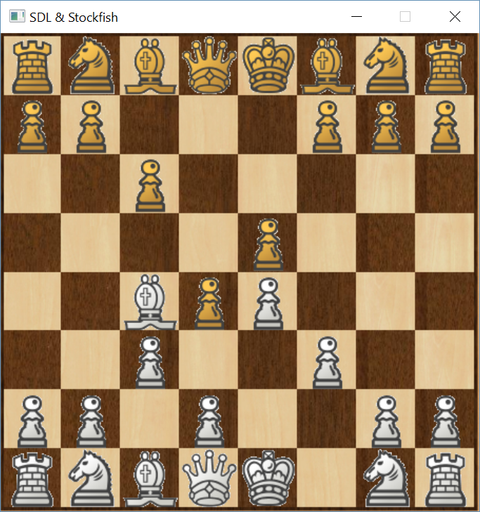

# Chess with Stockfish engine in SDL



Simple chess in SDL.
Ported to SDL from https://www.youtube.com/user/FamTrinli tutorials.
  
No moves correctness check implemented yet...
## Running

Install Stockfish or use included exe file.
```
https://stockfishchess.org/
```

## Help

